# 과제 5: 대화가 끊겨도 이어지는 프로젝트 (LLM Handover Benchmark)

> **SKT ALEPH 과제 5**: 과제 4(오늘의 진짜 정보판)의 기능을 확장하는 작은 개선 하나를 두 AI 세션이 차례로 이어서 완성하고, 이전 세션의 대화 전문 없이 7칸 인수인계 문서만으로 작업을 재개하여 사전 고정 검사 10개를 100% 완주하는 무로그인 공개 비교 보고서 시스템

[](https://react.dev)
[](https://www.typescriptlang.org)
[](https://tailwindcss.com)
[](https://vite.dev)
[](scripts/run-tests.ts)
[](HANDOVER.md)
[](https://oxc.rs)
[](https://prettier.io)
[](LICENSE)

---

## 1. 과제 5 공식 제출 정보 (T05-C34, T05-C35)

- **결과물 주소 (무로그인 공개 비교 보고서 웹)**: [https://skt-aleph-jinyeong-llm-talk.vercel.app](https://skt-aleph-jinyeong-llm-talk.vercel.app)
- **소스코드 주소**: [https://github.com/jinyeongjang/skt-aleph-jinyeong-llm-talk](https://github.com/jinyeongjang/skt-aleph-jinyeong-llm-talk)

### 짧은 확인 방법 4줄 (T05-C30)

```text
① 어디로 가나요: https://skt-aleph-jinyeong-llm-talk.vercel.app 로 접속합니다.
② 3단계 이내 무엇을 하나요: 1) [사전 고정 10대 검사] 섹션에서 [전체 10개 검사 실시간 실행(Run Tests)]을 눌러 T05-TEST-01~10 전수 100% 통과(10/10 PASS)를 확인합니다. 2) 상단 [블라인드 해제] 버튼을 눌러 Model A(Claude 3.7) vs Model B(Gemini 3.8 Flash)의 작업시간(28분/22분)과 호출수(14회/11회) 상한 준수를 확인합니다. 3) [7칸 인수인계] 탭에서 인수인계 무결성과 버전 ID 일치를 확인합니다.
③ 무엇이 보이면 통과인가요: 10대 고정 검사 실시간 녹색 PASS 배지, 블라인드 비교표의 공통 상한(60분, 25회) 내 안전 완주 지표, 인수인계 7항목 완비(누락 0건), 그리고 전국 3대 권역(서울·부산·제주) 실시간 관측값 및 어제 대비 이상 기온 감지 경보가 화면에 선명하게 보이면 통과입니다.
④ 안 될 때 무엇이 보이나요: 네트워크 장애나 외부 원천 오류 시 화면이 백화(Crash)되지 않고 해당 관측소만 주황색 '오래된 값 (Stale)' 배지와 직전 정상값이 안전하게 격리 보존되며, 인수인계 문서 누락이 있을 경우 문서 수정 전후가 투명하게 기록됩니다.
```

### AI와 나의 판단 3줄 (T05-C31)

```text
① AI에게 맡긴 일: 멀티 관측소(서울·부산·제주) Open-Meteo API 정규화 수집기, 10대 고정 검사 스위트 자동 실행 엔진, 어제 대비 이상 기온 감지(경계값 ±3.0°C 포함) 알고리즘, 멀티 LLM 연계 Markdown/JSON 브리핑 생성기 및 Oxlint/Prettier 자동화를 맡겼습니다.
② 학생이 직접 판단한 일: 외부 유료 키 유출 위험이 없는 완전 무키 비개인 공개 원천을 유지하고, 이전 세션의 대화 전문 일체 없이 인수인계 7개 필수 항목만으로 다른 모델(Gemini)이 즉시 작업을 재개할 수 있도록 엄격한 인수인계 계약 및 블라인드 측정 기준 설계를 직접 판단하고 지시했습니다.
③ AI 제안을 따르지 않은 일: AI가 초기에 제안한 중앙 집중식 세션 공유 서버나 복잡한 벡터 DB 기반 컨텍스트 검색 방식을 배제하고, 무로그인 공개 정적 웹 요구사항에 가장 충실하도록 브라우저 표준 로컬 저장 및 결정론적 인수인계 마크다운 문서를 통한 단일 책임 이양 구조를 채택했습니다.
```

---

## 2. 프로젝트 철학 및 엔지니어링 원칙

기존의 단순 채팅형 AI 코딩 방식은 컨텍스트 윈도우 한계, 지침 망각(Context Drift), 특정 모델 종속이라는 치명적인 결함을 안고 있습니다. 본 프로젝트는 다음 5가지 엔지니어링 철학을 현실에서 작동 가능한 소프트웨어 아키텍처로 구현하였습니다:

1. **단일 진실 공급원(Single Source of Truth)**: AI 세션의 일시적 메모리가 아닌, Git 저장소와 규격화된 [`HANDOVER.md`](./HANDOVER.md)가 프로젝트의 영구적 생명선이 됩니다.
2. **이종 모델 파이프라인(Multi-LLM Pipeline)**: 초기 설계에 특화된 모델(Claude 3.7)과 구현 가속에 특화된 경량 모델(Gemini 3.8 Flash)을 인수인계 규격으로 매끄럽게 연결합니다.
3. **불변의 품질 게이트(Quality Gate)**: 작업 전 확정된 10개의 검사는 작업 도중 누구도 삭제, 완화, 변경할 수 없으며, 인간 엔지니어가 최종 품질 감사인으로 기능합니다.
4. **정량적 벤치마크 기반 도구 선택**: 막연한 인상이 아닌 소요 시간, 호출 횟수, 실패 회차, 코드 재작업량의 객관적 측정치로 최적의 도구를 선택합니다.
5. **실무 프로페셔널 인수인계 훈련**: 사람 동료나 다른 개발 팀에게 작업을 온보딩할 때 요구되는 가장 엄격한 인수인계 7개 항목을 충족합니다.

---

## 3. 시스템 아키텍처 & 4단계 작업 흐름 (T05-C07)

```mermaid
flowchart LR
    subgraph Step1["Step 1: AI A 시작 (13:00)"]
        A_Start["작업 착수\n버전: b4a1c72f"]
        Limits["공통 상한 설정\n시간: 60분 / 호출: 25회"]
        Tests10["사전 고정 검사 10개 확정\nT05-TEST-01~10"]
        A_Start --> Limits --> Tests10
    end

    subgraph Step2["Step 2: AI A 중단 & 인계 (13:28)"]
        A_Dev["기초 모듈 구현\nT05-TEST-01~06 (6 PASS)"]
        A_Stop["상한 내 안전 중단 (28분 / 14회)\n버전: 1a9f8657"]
        Handover["7칸 인수인계 문서 작성\nHANDOVER.md\n인수인계 검증"]
        Tests10 --> A_Dev --> A_Stop --> Handover
    end

    subgraph Step3["Step 3: AI B 시작 (13:35)"]
        B_Start["새 세션 오픈 (Gemini 3.8 Flash)\n대화 전문 0% 미제공"]
        B_Feed["저장소 + HANDOVER.md만 투입\n누락 없음 (0건 확인)"]
        Handover --> B_Start --> B_Feed
    end

    subgraph Step4["Step 4: AI B 완료 (13:57)"]
        B_Dev["잔여 모듈 구현\nT05-TEST-07~10 (4 PASS)"]
        B_Done["10대 검사 100% 완주 (10/10)\n버전: 942cf9d\n비교 보고서 산출"]
        B_Feed --> B_Dev --> B_Done
    end
```



---

## 4. 두 AI 세션 블라인드 측정 비교 요약표 (T05-C23 ~ T05-C28, T05-C50 ~ T05-C53)

사전 고정된 공통 상한(**시간 60분**, **요청 25회**) 하에서 두 AI가 수행한 객관적 측정치입니다:

| 평가 항목 (기준 ID)              | 사전 공통 상한 |        Model A (세션 1)        |           Model B (세션 2)            |   충족 상태 및 판정 비고    |
| :------------------------------- | :------------: | :----------------------------: | :-----------------------------------: | :-------------------------: |
| **실제 모델/서비스 (T05-C39)**   |  서로 다른 AI  | **Cursor (Claude 3.7 Sonnet)** | **Gemini 3.8 Flash(Antigravity CLI)** |     이종 모델 연계 충족     |
| **실제 작업시간 (T05-C23)**      |   60분 이하    |      **28분** (32분 여유)      |         **22분** (38분 여유)          | **T05-C50, C51 상한 준수**  |
| **실제 요청·호출 수 (T05-C24)**  |   25회 이하    |      **14회** (11회 여유)      |         **11회** (14회 여유)          | **T05-C52, C53 상한 준수**  |
| **오류 회차 수 (T05-C25)**       |  1+ FAIL 회차  |            **3회**             |                **1회**                | 고정 검사 실행 중 FAIL 회차 |
| **검사 통과 수 (T05-C27)**       |   10개 목표    |  **6 / 10** (중단 시점 보존)   |        **10 / 10** (100% 완주)        |    **T05-C09, C16 완주**    |
| **소스 변경량 (T05-C26)**        | 순수 소스 코드 |        **+420 / -35줄**        |           **+315 / -18줄**            |   고정 커밋 쌍 산출 완료    |
| **블라인드 가림 처리 (T05-C28)** |  가림 기본값   |           `Model A`            |               `Model B`               |     언마스크 토글 지원      |

### 다음 작업에서 도구를 고르는 본인의 기준 (T05-C29)

> **"정확한 스펙과 인수인계 문서가 준비되어 있을 때는 신속하고 비용 효율적인 경량 LLM(Gemini)을, 초기 아키텍처 및 복잡한 정규화 설계 단계에서는 추론 능력이 뛰어난 모델을 우선 선택한다."**

---

## 5. 사전 고정 10대 검사 스위트 (T05-C01 ~ T05-C04, T05-C17 ~ T05-C20)

작업 착수 전 사전 고정된 10대 검사 목록이며, **검사 삭제 0건(T05-C18)**, **검사 완화 0건(T05-C19)**, **기대값 변경 0건(T05-C20)** 불변성을 엄격히 준수합니다:

|     검사 ID     | 검사 명칭               | 입력 파라미터 (Input)                              | 관찰 가능한 기대값 (Expected)                          | 경계값 조건            | AI A |   AI B   |
| :-------------: | :---------------------- | :------------------------------------------------- | :----------------------------------------------------- | :--------------------- | :--: | :------: |
| **T05-TEST-01** | 관측소 메타데이터 검증  | 전국 3대 관측소(서울·부산·제주) 좌표 및 KST 시간대 | 위도(-90~~90), 경도(-180~~180) 유효 및 Asia/Seoul 일치 | 고유 ID 식별성         | PASS | **PASS** |
| **T05-TEST-02** | 실시간 관측값 정규화    | 3개 관측소 Open-Meteo 실시간 응답 페이로드         | NormalizedReading 6대 필수 메타데이터 100% 충족        | 영하/영상 및 null 방어 | PASS | **PASS** |
| **T05-TEST-03** | 단일 장애 격리 및 보존  | 부산 500 에러, 서울/제주 정상 수집                 | 부산만 Stale 격리 및 직전 정상값(24.2°C) 보존          | 부분 장애 분리 격리    | PASS | **PASS** |
| **T05-TEST-04** | 동일 날짜 단일 행 갱신  | 동일 KST 날짜 2회 연속 수집 (18.4°C ➔ 18.9°C)      | 해당 날짜 단 1행 유지, 최신값 원자적 갱신              | 날짜 키 중복 0건       | PASS | **PASS** |
| **T05-TEST-05** | 익일 날짜 신규 행 생성  | 2026-09-14 ➔ 2026-09-15 익일 수집                  | 새 날짜 1행 정상 추가 (총 2행)                         | KST 자정 경계 전환     | PASS | **PASS** |
| **T05-TEST-06** | 전국 기온 편차 계산     | 서울 18.4°C, 부산 22.8°C, 제주 25.6°C              | 최고(제주) - 최저(서울) = 7.2°C 정확 산출              | 부동소수점 오차 방지   | PASS | **PASS** |
| **T05-TEST-07** | 이상 기온 감지 트리거   | 어제 20.8°C, 오늘 16.5°C (변화량 ΔT = -4.3°C)      | `isAnomaly: true`, 급격한 기온 하강 경보 발령          | 임계치 ±3.0°C 초과     | FAIL | **PASS** |
| **T05-TEST-08** | 이상 기온 판정 경계값   | Case A: 2.99°C / Case B: 3.00°C                    | Case A 정상(false), Case B 경보(true)                  | 경계값(≥3.00°C) 포함   | FAIL | **PASS** |
| **T05-TEST-09** | 멀티 LLM 연계 브리핑    | 3개 관측소 기온, 편차, 이상 감지 객체              | Markdown 요약 및 JSON Schema 페이로드 생성             | JSON 스키마 무결성     | FAIL | **PASS** |
| **T05-TEST-10** | 보안 및 개인정보 무결성 | 소스코드, 저장소 파일, 네트워크 요청               | 비밀키 패턴 0건, 개인 식별 정보(PII) 0건               | 완전 무키 공개 원천    | FAIL | **PASS** |

---

## 6. 일곱 칸 인수인계 명세 ([`HANDOVER.md`](./HANDOVER.md): T05-C10 ~ T05-C15)

인수인계 전문은 [`HANDOVER.md`](./HANDOVER.md)에 영구 보존되어 있습니다:

- **문서 버전 ID**: `1a9f865733a43aa0a88925bab970ed8affbcb1f1` (T05-C12)
- **인수인계 누락 점검**: 누락 없음 (0건 확인 완료, T05-C15)
- **인수인계 7항목 상세 (T05-C10)**:
  1. **목표 (Goal)**: 과제 4 기반 전국 3대 관측소 실시간 비교 + 이상 기온 감지 + LLM 브리핑 엔진 완성
  2. **현재 상태 (Current Status)**: 멀티 관측소 정규화 엔진 완료 (6 PASS / 4 FAIL), 버전 `1a9f865733a43aa0a88925bab970ed8affbcb1f1`
  3. **실행 명령 (Execution Commands)**: `npm install && npm test && npm run dev && npm run build` (새 환경 100% 재현, T05-C11)
  4. **통과 검사 (Passed Tests)**: T05-TEST-01 ~ T05-TEST-06 (6건)
  5. **남은 문제 (Remaining Issues)**: T05-TEST-07 ~ T05-TEST-10 (4건)
  6. **다음 행동 (Next Action)**: `anomalyDetector.ts`, `llmBriefing.ts`, `securityAudit.ts` 구현 가이드
  7. **건드리지 말 것 (Do Not Touch)**: 고정 검사 10개 불변성, 완전 무키 비개인 공개 원천 원칙, 과제 4 stale 보존 메커니즘

---

## 7. LMS 1-Click 등록 양식 복사 도우미 (Image 5-7, 5-8, 5-6 매칭)

과제 플랫폼의 `선택 과정 기록 남기기` 폼에 그대로 붙여넣을 수 있는 공식 양식입니다:

### [A 모델 시작 기록 양식 (Image 5-7)]

```text
서비스 표시 ID: Cursor
모델 표시 ID: Claude 3.7 Sonnet
시간 상한(분): 60
요청 상한(회): 25
두 모델에 똑같이 줄 최초 요청: 과제 4(오늘의 진짜 정보판)의 서울 단일 관측소 한계를 넘어 전국 3대 권역(서울, 부산, 제주) 멀티 관측소 실시간 기상 관측 동기화 + KST 기준 어제 대비 이상 기온 감지(Anomaly Alert) 및 멀티 LLM 연계 구조화 브리핑 엔진을 완성하라. 사전 고정 검사 10개를 100% 만족해야 한다.
시작 URL: https://github.com/jinyeongjang/skt-aleph-jinyeong-llm-talk
고정 검사 목록·기대 결과:
T05-TEST-01 (관측소 메타데이터 검증): 위도(-90~90), 경도(-180~180) 유효 및 Asia/Seoul 일치
T05-TEST-02 (실시간 관측값 정규화): NormalizedReading 6대 필수 메타데이터 100% 충족
T05-TEST-03 (단일 장애 격리 및 보존): 부산 500 격리 및 직전 정상값(24.2°C) 보존, 타 관측소 Fresh 유지
T05-TEST-04 (동일 날짜 단일 행 갱신): 동일 날짜 단 1행 유지, 최신값 원자적 갱신
T05-TEST-05 (익일 날짜 신규 행 생성): 익일 수집 시 신규 1행 생성 (총 2행)
T05-TEST-06 (전국 기온 편차 계산): 최고 - 최저 기온 편차 정확 산출 (7.2°C)
T05-TEST-07 (이상 기온 감지 트리거): 어제 대비 ΔT = -4.3°C 급변 시 isAnomaly: true 경보 발령
T05-TEST-08 (이상 기온 판정 경계값): 2.99°C 정상(false), 3.00°C 경보(true) 엄격 판정
T05-TEST-09 (멀티 LLM 연계 브리핑): 규격화된 Markdown 요약 및 JSON Schema 페이로드 생성
T05-TEST-10 (보안 및 개인정보 무결성): API Key 0건, 개인 식별 정보(PII) 0건 확인
```

### [A 모델 종료·인계 기록 양식 (Image 5-8)]

```text
서비스 표시 ID: Cursor
모델 표시 ID: Claude 3.7 Sonnet
실제 사용(분): 28
실제 요청(회): 14
A 종료 commit URL: https://github.com/jinyeongjang/skt-aleph-jinyeong-llm-talk/commit/1a9f865733a43aa0a88925bab970ed8affbcb1f1

A 고정 검사 결과:
총 10개 검사 중 6개 통과 (6 PASS / 4 FAIL, T05-C09 보존)
[통과 검사 (PASS) - 6건]
- T05-TEST-01: 멀티 관측소 메타데이터 유효성 검증 (PASS)
- T05-TEST-02: 멀티 관측소 실시간 관측값 정규화 (NormalizedReading) (PASS)
- T05-TEST-03: 단일 관측소 외부 실패 시 격리 및 타 관측소 정상값 보존 (PASS)
- T05-TEST-04: 동일 Asia/Seoul 날짜 다회 수집 시 단일 행 원자적 갱신 (PASS)
- T05-TEST-05: 익일 KST 날짜 수집 시 신규 일별 기록 행 생성 (PASS)
- T05-TEST-06: 전국 기온 편차(Spread: 최고 - 최저) 산출 정확성 (PASS)

[미완성 검사 (FAIL) - 4건]
- T05-TEST-07: 어제 대비 급변 이상 기온 감지(Anomaly Alert) 트리거 (FAIL)
- T05-TEST-08: 이상 기온 판정 경계값(|ΔT| == 2.99°C vs 3.00°C) 정확성 (FAIL)
- T05-TEST-09: 멀티 LLM 연계 브리핑 생성기 (Markdown & 구조화 JSON) (FAIL)
- T05-TEST-10: 보안 무결성: 비밀키 원문 및 개인정보(PII) 0건 검증 (FAIL)

B에게 넘길 인계문:
# 과제 5 일곱 칸 인수인계 명세 (HANDOVER)
버전 ID: 1a9f865733a43aa0a88925bab970ed8affbcb1f1
누락 점검: 누락 없음 (0건)

1. 목표 (Goal): 과제 4의 서울 단일 관측소 한계를 넘어 전국 3대 권역(서울, 부산, 제주)의 비개인 공개 원천(Open-Meteo 무키 API) 실시간 수집·동기화, KST 기준 어제 대비 이상 기온 감지(±3.0°C) 및 후속 LLM 연계 구조화 브리핑 생성기 완성.
2. 현재 상태 (Current Status): AI A(소요 28분, 호출 14회, 오류 3회)에서 6 PASS / 4 FAIL 상태로 안전하게 작업 중단.
3. 실행 명령 (Execution Commands): npm install && npm test && npm run dev && npm run build && npm run lint
4. 통과 검사 (Passed Tests, 6건): T05-TEST-01~06 통과
5. 남은 문제 (Remaining Issues, 4건): T05-TEST-07~10 (이상 기온 감지, 경계값 판정, 브리핑 생성기, 보안 감사)
6. 다음 행동 (Next Action): anomalyDetector, llmBriefing, securityAudit 모듈 구현 후 npm test 10/10 PASS 달성
7. 건드리지 말 것 (금지 범위): 사전 고정 10대 검사 불변, 완전 무키 비개인 원천 원칙 준수, stale 배지 및 복구 로직 유지
```

### [B 모델 연계 기록 양식 (Image 5-6)]

```text
서비스 표시 ID: Antigravity CLI
모델 표시 ID: Gemini 3.8 Flash(Antigravity CLI)
시간 상한(분): 60
요청 상한(회): 25
인수인계 문서 기반 요청: 앞선 세션의 대화 전문 없이, 저장소(버전 1a9f865733a43aa0a88925bab970ed8affbcb1f1)와 7칸 인수인계 문서(HANDOVER.md)만을 참조하여 남은 4개 검사(T05-TEST-07~10)를 완성하고 전체 10개 검사를 완주하라. 고정 검사의 삭제, 완화, 기대값 변경은 일체 불가하다.
인계 URL: https://github.com/jinyeongjang/skt-aleph-jinyeong-llm-talk
완료 URL: https://github.com/jinyeongjang/skt-aleph-jinyeong-llm-talk
```

---

## 8. 완성된 핵심 개선 기능 (과제 4 기반 기능 완성, T05-C16)

기존 과제 4의 단일 관측소(서울) 한계를 극복하여 다음 3대 기능을 완성했습니다:

1. **전국 3대 권역(서울, 부산, 제주) 실시간 관측망 동기화**:
   - Open-Meteo 비개인 공개 API를 통해 실시간 기온 수집
   - [`NormalizedReading`](./src/types/board.ts) 표준 인터페이스를 통한 일치성 보장
2. **남북 열적 편차(Thermal Spread) 및 어제 대비 이상 기온 감지(Anomaly Alert)**:
   - 최고 관측소와 최저 관측소 간 편차(Spread: max - min) 실시간 산출
   - 어제 기온 대비 절대 변화량 $|ΔT| \ge 3.0^\circ\text{C}$ 초과 시 급격한 상승/하강 경보 발령
   - 경계값(2.99°C vs 3.00°C) 엄격 판정
3. **멀티 LLM 연계 브리핑 생성기**:
   - 후속 LLM(Claude, Gemini, GPT 등)이 후속 작업의 컨텍스트로 바로 활용할 수 있는 규격화된 Markdown 브리핑 및 표준 JSON Schema 페이로드 생성

---

## 9. 보안 및 개인정보 무결성 감사 (T05-C37, T05-C38)

본 프로젝트는 무로그인 공개 웹으로 배포되며, 저장소와 번들 코드에 일체의 민감 정보가 포함되지 않도록 정규식 자동 스캐너([`src/utils/securityAudit.ts`](./src/utils/securityAudit.ts))를 통해 상시 검증합니다:

- **비밀키 원문 0건 (T05-C38)**: OpenAI `sk-`, Google `AIza`, GitHub 토큰, AWS Key 등 비밀값 원문 0건 확인 완료
- **개인정보(PII) 0건 (T05-C37)**: 주민등록번호, 휴대폰번호, 개인 이메일 0건 확인 완료
- **완전 무키 공개 API**: Open-Meteo 공개 엔드포인트만을 사용하여 API Key 노출 가능성을 원천 차단

---

## 10. 완주 체크리스트 & 37개 통과 기준(T05-C01 ~ T05-C53) 충족 현황

| 분류       | 기준 ID       | 세부 요건                                                                                                           | 달성 근거                                               |     상태      |
| :--------- | :------------ | :------------------------------------------------------------------------------------------------------------------ | :------------------------------------------------------ | :-----------: |
| **카드 1** | T05-C01 ~ C07 | 검사 10개 고정, 고유 ID, 입력/기대값 명시, 공통 시간(60분)/호출(25회) 상한, 4단계 순서 보증                         | `testSpecs.ts`, `benchmarkData.ts` 확정                 | **100% PASS** |
| **카드 2** | T05-C08 ~ C09 | AI A 작업 뒤 저장소 버전 ID 보존, AI A 검사 결과(6 PASS / 4 FAIL) 보존                                              | 버전 `1a9f8657` 영구 보존                               | **100% PASS** |
| **카드 3** | T05-C10 ~ C12 | 인수인계 7항목 완비, 새 폴더 재현성, 문서 버전 ID와 저장소 버전 ID 일치                                             | `HANDOVER.md` 작성 및 검증                              | **100% PASS** |
| **카드 4** | T05-C13 ~ C20 | 저장소/인수인계만 제공, 인수인계 원문 동일성 일치, 누락 없음(0건), 기능 완성, 검사 불변성 3원칙(삭제/완화/변경 0건) | 원문 동일성 일치, 10/10 PASS 완주                       | **100% PASS** |
| **카드 4** | T05-C39       | AI A와 AI B 이종 모델/서비스 사용                                                                                   | Claude 3.7 / Cursor ➔ Gemini 3.8 Flash(Antigravity CLI) | **100% PASS** |
| **카드 4** | T05-C50 ~ C53 | AI A/B 실제 시간 및 호출수 공통 상한 이하 준수                                                                      | A(28분/14회), B(22분/11회) ≤ 60분/25회                  | **100% PASS** |
| **카드 5** | T05-C21       | 무로그인 공개 접근성 (새 시크릿 창)                                                                                 | Vercel 무인증 공개 정적 배포                            | **100% PASS** |
| **카드 5** | T05-C23 ~ C27 | 비교표 5대 지표(시간, 호출수, 오류회차, 통과수, 소스재작업량) 수록                                                  | 비교표 및 카드 완비                                     | **100% PASS** |
| **카드 5** | T05-C28       | 모델명 가림 처리 (블라인드 평가 모드)                                                                               | `Model A`, `Model B` 기본 가림                          | **100% PASS** |
| **카드 5** | T05-C29       | 다음 작업 도구 선택 기준 1문장 명시                                                                                 | 1문장 기준 명시 수록                                    | **100% PASS** |
| **카드 5** | T05-C30 ~ C31 | 짧은 확인 4줄, AI 판단문 3줄 구분 수록                                                                              | 번호 매김 4줄/3줄 엄격 분리 수록                        | **100% PASS** |
| **카드 5** | T05-C34 ~ C35 | 고정 버전 해시 영구 URL 제공                                                                                        | 40자리 고정 해시 링크 제공                              | **100% PASS** |
| **카드 5** | T05-C37 ~ C38 | 개인정보(PII) 0건, 비밀값 원문 0건                                                                                  | 정규식 보안 스캐너 전수 감사 통과                       | **100% PASS** |

> 전체 37개 세부 기준의 1:1 증빙 명세는 [`CRITERIA.md`](./CRITERIA.md)에서 전수 확인하실 수 있습니다.

---

## 11. 로컬 설치 및 자동화 품질 검증

```bash
# 1. 의존성 패키지 설치
npm install

# 2. 사전 고정 10대 검사 CLI 자동 실행 (10/10 PASS 확인)
npm test

# 3. 로컬 개발 서버 실행 (기본 포트 http://localhost:5173)
npm run dev

# 4. TypeScript 타입 검사 및 프로덕션 번들 빌드
npm run build

# 5. Oxlint 정적 코드 분석
npm run lint

# 6. Prettier 포맷팅 검증
npm run format:check
```

---

## 12. 프로젝트 구조 (Project Structure)

```text
.
├── .github/
├── scripts/
│   └── run-tests.ts              # 사전 고정 10대 검사 CLI 러너 (npm test)
├── src/
│   ├── components/
│   │   ├── Header.tsx            # 반응형 상단 고정 헤더 & 신선도/블라인드 상태 표시
│   │   ├── BlindBenchmarkSection.tsx # 카드 5 블라인드 비교 보고서 & 상한 대조표
│   │   ├── FixedTestsSection.tsx # 카드 1·2·4 사전 고정 10대 검사 스위트 & 인터랙티브 러너
│   │   ├── HandoverSection.tsx   # 카드 3·4 일곱 칸 인수인계 문서 뷰어 & 무결성 대조기
│   │   ├── MultiStationLiveSection.tsx # 완성된 개선 기능 (서울·부산·제주 날씨 & 이상감지 & LLM 브리핑)
│   │   ├── SubmissionModal.tsx   # 짧은 확인 4줄, 판단문 3줄 및 LMS 양식 복사 도우미
│   │   ├── CriteriaModal.tsx     # 37개 통과 기준(T05-C01 ~ C53) 전수 체크리스트
│   │   ├── SecurityAuditModal.tsx# 비밀키 0건 및 PII 0건 실시간 정규식 감사기
│   │   └── Footer.tsx            # 푸터 및 영구 링크
│   ├── types/
│   │   ├── benchmark.ts          # 고정 검사, 벤치마크 모델, 인수인계 타입
│   │   ├── weather.ts            # 관측소, 이상 기후 감지, 편차, 브리핑 타입
│   │   └── board.ts              # NormalizedReading 및 상태 타입
│   ├── utils/
│   │   ├── testSpecs.ts          # 사전 고정 10대 검사 불변 명세 (T05-C01~C04)
│   │   ├── testRunner.ts         # 10대 검사 실행 엔진 (브라우저 & Node 공용)
│   │   ├── anomalyDetector.ts    # 이상 기온 감지 엔진 (|ΔT| >= 3.0°C 경계값 포함)
│   │   ├── llmBriefing.ts        # 멀티 LLM 연계 Markdown/JSON 브리핑 생성기
│   │   ├── multiStationEngine.ts # 3개 관측소 수집, 편차 계산 및 원자적 갱신
│   │   ├── securityAudit.ts      # 비밀키 원문 및 PII 0건 정규식 스캐너
│   │   ├── benchmarkData.ts      # 공통 상한 및 Model A vs B 측정 데이터
│   │   ├── handoverData.ts       # 일곱 칸 인수인계 데이터 및 무결성 검증기
│   │   └── kst.ts                # Asia/Seoul KST 시간대 변환기
│   ├── App.tsx                   # 메인 대시보드 레이아웃
│   └── main.tsx                  # 진입점
├── condition/                    # 공식 평가 기준 이미지 원본 (condi 5-1 ~ 5-7)
├── HANDOVER.md                   # 공식 7칸 인수인계 문서 원본
├── CRITERIA.md                   # 37개 세부 평가 기준 공식 명세서
├── GEMINI.md                     # 프로젝트 정의 및 AI Agent 가이드라인
└── package.json                  # 프로젝트 의존성 및 검증 스크립트
```

---

## 13. 라이선스

MIT License. 비개인 공개 원천(Open-Meteo) 데이터는 CC BY 4.0 라이선스를 따릅니다.
